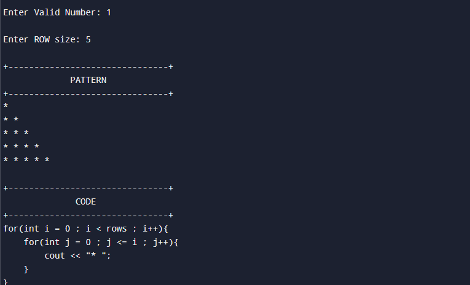
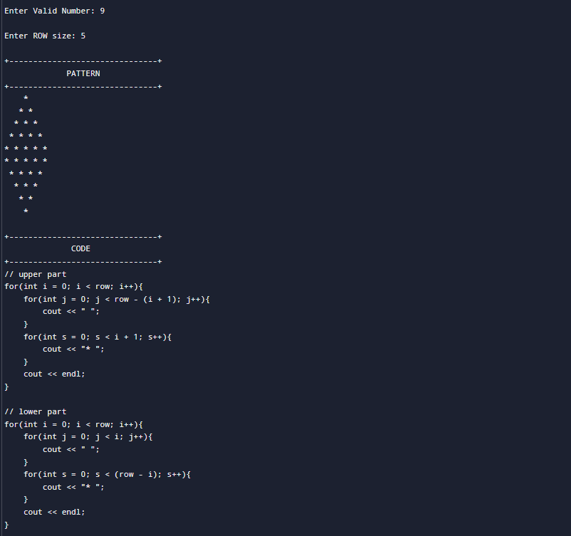
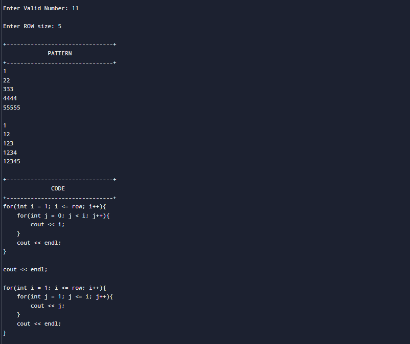
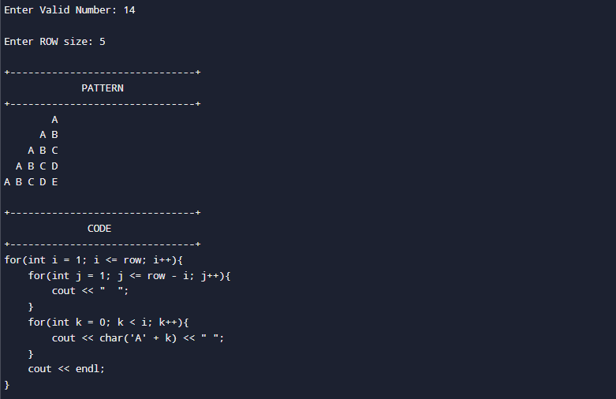

<div align="center">

# 🎨 C++ Pattern Printing Collection

A menu-driven C++ console application that generates **15 different pattern printing programs** using loops, functions, and switch-case statements.


</div>

---

## 📖 About

This project was built to improve my understanding of:

- Nested Loops
- Functions
- Switch Statements
- Pattern Printing Logic
- User Input Handling
- Menu Driven Programming
- Basic Error Handling

Each pattern is generated dynamically based on the number of rows entered by the user.

An additional feature of this project is that **the source code of each pattern is displayed after printing the output**, making it useful for beginners who are learning C++.

---

# ✨ Features

- ✅ 15 Different Pattern Programs
- ✅ Menu Driven Interface
- ✅ User chooses the pattern
- ✅ Custom row size input
- ✅ Displays pattern output
- ✅ Displays the C++ code used for each pattern
- ✅ Error handling for invalid menu choices
- ✅ Continue without restarting the program

---

# 📂 Patterns Included

| No | Pattern |
|----|----------------------------|
| 1 | Simple Pyramid |
| 2 | Flipped Simple Pyramid |
| 3 | Inverted Pyramid |
| 4 | Flipped Inverted Pyramid |
| 5 | Triangle |
| 6 | Inverted Triangle |
| 7 | Half Diamond Pattern |
| 8 | Flipped Half Diamond Pattern |
| 9 | Diamond Pattern |
|10 | Hourglass Pattern |
|11 | Number Pyramid |
|12 | Rotated Number Pyramid |
|13 | Palindrome Triangle |
|14 | Alphabet Pyramid |
|15 | Continuous Alphabet Pyramid |

---

# 🖥️ Menu Preview

> Add a screenshot named **menu.png** inside the `images` folder.

```text
+-------------------------------+
        PYRAMID PATTERNS
+-------------------------------+

1. Simple Pyramid
2. Flipped Simple Pyramid
3. Inverted Pyramid
...
15. Continuous Alphabet Pyramid
```


---

# 📸 Sample Outputs

## ⭐ Simple Pyramid



---

## 💎 Diamond Pattern



---

## 🔢 Number Pyramid



---

## 🔠 Alphabet Pyramid



---

# 🚀 How to Run

Clone the repository

```bash
git clone https://github.com/yourusername/cpp-pattern-printing.git
```

Go to the project directory

```bash
cd cpp-pattern-printing
```

Compile

```bash
g++ main.cpp -o pattern
```

Run

```bash
./pattern
```

Windows

```bash
g++ main.cpp -o pattern.exe
pattern.exe
```

---

# 🛠️ Technologies Used

- C++
- Visual Studio Code
- GCC Compiler

---

# 📁 Project Structure

```
cpp-pattern-printing/
│
├── images/
│   ├── menu.png
│   ├── simple-pyramid.png
│   ├── diamond.png
│   ├── number-pyramid.png
│   └── alphabet-pyramid.png
│
├── main.cpp
└── README.md
```

---

# 🎯 Learning Objectives

This project helped me understand

- Nested Loops
- Pattern Logic
- Functions
- Switch Case
- Modular Programming
- Console Applications
- Problem Solving

---

# 🌟 Future Improvements

- Add Hollow Patterns
- Pascal Triangle
- Butterfly Pattern
- Binary Pattern
- Floyd's Triangle
- Save pattern output to a file
- Colored Console Output

---

# 👨‍💻 Author

**Nadeesha Malshan**

Computer Science Undergraduate

- 🌐 GitHub: https://github.com/MalshanDev
- 💼 LinkedIn: *(Add your LinkedIn URL)*

---

## ⭐ If you like this project

Give it a ⭐ on GitHub and feel free to fork it!
